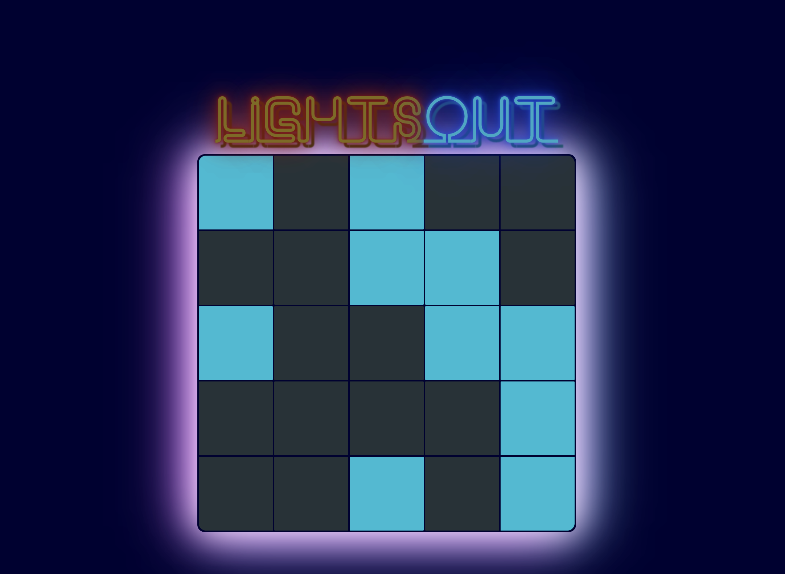

# Lights Out!

Lights out is a classic game where your goal is to toggle all of the lights off on the board. Clicking on a cell will toggle itself and four of its surrounding cells as well.

## Screenshots

**Board:**

**Winner:**

